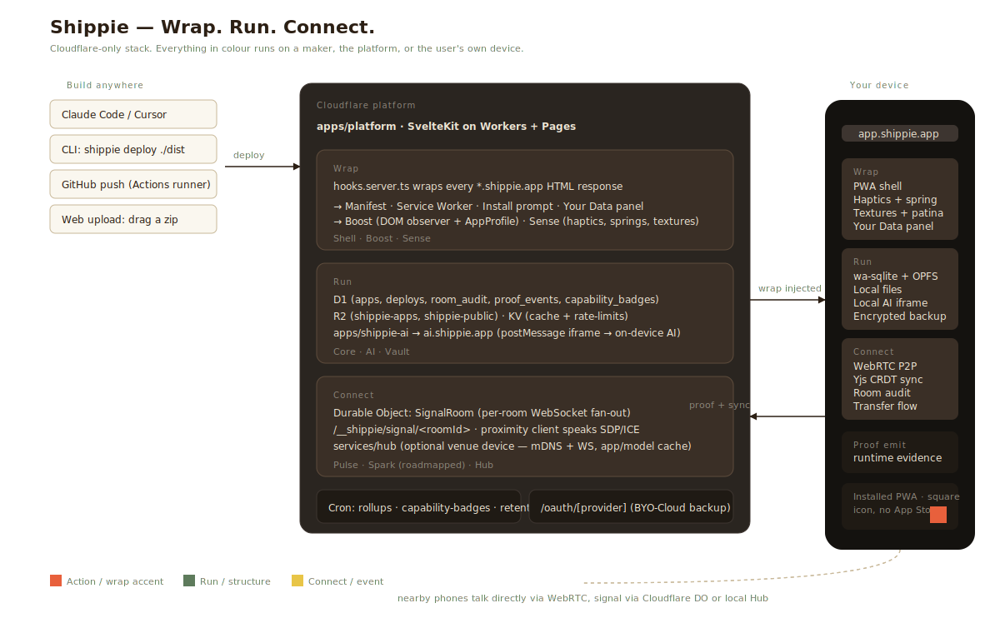

# Architecture

Shippie is a platform for **local tools that know each other**.

- **Local** — accepted tools keep user data on the device by default.
- **Private** — no external login, third-party user-data store, trackers, or ads in the public tool surface.
- **Connected to each other** — tools share local signals through intents and encrypted Shippie relay when the user chooses live collaboration.

Underneath the public story, the platform is composed of Shell, Boost, Sense, Core, AI, Vault, Pulse, Spark, and Hub. Documentation, the SDK, and the whitepaper map them in detail; product surfaces lead with the Local Tool promise.

## Stack

The SvelteKit + Cloudflare cutover shipped on 2026-04-26 (commit `56179bf`). The active production architecture is Cloudflare-first: Workers, D1, R2, KV, Durable Objects, Workers Assets, scheduled triggers, and Cloudflare Email.

| Concern | Technology |
|---|---|
| Platform app | SvelteKit (`apps/platform/`) on Cloudflare Pages |
| Wrapper / subdomain routing / SDK injection | Cloudflare Workers via SvelteKit's `hooks.server.ts` |
| Database | Cloudflare D1 (SQLite at the edge) — schema in `packages/db/` |
| File storage | Cloudflare R2 (`shippie-apps`, `shippie-public`) |
| Cache / KV | Cloudflare KV |
| Real-time signalling | Cloudflare Durable Objects (`SignalRoom`) |
| Local AI runtime | Container worker (`apps/platform/src/lib/container/ai-worker.ts`) loading the versioned Transformers runtime artifact; `apps/shippie-ai/` remains the older standalone AI surface while the container path matures |
| Local-runtime engines | wa-sqlite (`packages/local-db/`), OPFS (`packages/local-files/`), Transformers.js / WebNN (`packages/local-ai/` + container worker) |
| Mesh transport | WebRTC peer-to-peer over Durable Object signalling |
| Hub (venue) | Bun + Docker (`services/hub/`) — mDNS + WebSocket signal, app/model cache |
| Build runner | GitHub Actions for repo-based deploys |

## Repo layout

```
apps/
  platform/                 SvelteKit + Cloudflare — marketplace, dashboard, deploy API, wrapper (AGPL)
  shippie-ai/               Cross-origin AI iframe at ai.shippie.app — Vite + Workbox SW (AGPL)
  showcase-recipe/          Demo: local DB + offline cooking
  showcase-journal/         Demo: local DB + patina + extractive summaries
  showcase-whiteboard/      Demo: real-time collaboration (Pulse)
  showcase-live-room/       Demo: pub-quiz / classroom Live Room (Pulse + Sense)

packages/
  sdk/                      @shippie/sdk — client SDK for deployed apps (MIT)
                            subpath exports: ./native, ./wrapper
  cli/                      @shippie/cli — terminal deploy tool (MIT)
  mcp-server/               @shippie/mcp — MCP server for AI tools (MIT)
  pwa-injector/             Manifest + service worker generation
  local-db/                 wa-sqlite + IndexedDB fallback
  local-files/              OPFS path abstraction
  local-ai/                 LocalAI bridge spec (consumed by sdk)
  local-runtime/            DB + telemetry orchestration
  local-runtime-contract/   Shared local-runtime types
  ambient/                  Background analysis scheduler + insight surfacing
  intelligence/             Spatial memory, pattern tracking, predictive preload, recall
  proximity/                Rooms, WebRTC, gossip, transfer primitives
  backup-providers/         Encrypted backup adapters (iCloud, Google Drive, Dropbox)
  session-crypto/           Encryption helpers
  analyse/                  HTML/CSS/JS scanner → AppProfile + Local Tool policy scan
  access/                   OAuth + OIDC adapters
  shared/                   Shared project types
  db/                       Drizzle schema + D1 migrations
  dev-storage/              Local dev IndexedDB / KV simulator

services/
  hub/                      Self-hosted venue device — Bun server + Docker, mDNS + WS signalling

docs/
  CURRENT_STATE.md          Living truth file — read first
  architecture.md           This file
  self-hosting.md           Run your own instance
  superpowers/plans/        Active and archived design plans
```

The umbrella plan and Non-Negotiables live at `/Users/devante/.claude/plans/review-all-of-this-swift-token.md`. The active build roadmap is `docs/superpowers/plans/2026-04-25-intelligence-layer-roadmap.md`.

## Workspace package boundaries

Internal packages (`@shippie/proximity`, `@shippie/local-db`, `@shippie/ambient`, etc.) expose `exports` pointing at TypeScript source, not built `dist/`:

```json
"exports": {
  ".": {
    "types": "./src/index.ts",
    "import": "./src/index.ts"
  }
}
```

This pattern keeps typecheck immune to build state. Vite (used by SvelteKit + the AI iframe) and Bun both transpile TS source natively, so production builds work the same way. Build artifacts are still generated via tsup for any future external consumers; right now every workspace package is `private: true`.

## What runs where



Open [`architecture.svg`](./architecture.svg) for the full diagram. In short:

- **Maker tools** on the left (Claude Code, CLI, MCP, GitHub, web upload) deploy via the Cloudflare platform.
- **Deploy truth** in the middle (Cloudflare Workers + Pages + D1 + R2 + KV + Durable Objects) handles deploy ingestion, package artifacts, wrapper injection on every `*.shippie.app` HTML response, proof-event ingestion + cron rollup, and the `/__shippie/signal/[roomId]` WebSocket signalling DO.
- **Portable packages** keep URL ownership, custom-domain metadata, version lineage, app permissions, and the static build together so the same artifact can run on `shippie.app` or a future `hub.local` node.
- **User device** on the right runs the actual app: standalone URL if opened directly, or the Shippie container if installed. Local SQLite/OPFS, shared AI model cache, Your Data, and cross-app intents live in the container/device boundary; WebRTC connects nearby devices.

Maker code is delivered as static files from R2; the Worker injects the wrapper script + manifest + SW around every HTML response. End-user data lives on the user's device. Shippie holds platform metadata (listings, feedback, room audit, proof events) in D1 — never readable per-user app data.

## Local Tool Policy

The public app kind is now **Local Tool**. Capabilities describe optional
behavior: works offline, secure backup, reference data, local AI, private
relay, intents, local DB, and local files.

Every browser zip upload, trial upload, CLI deploy, MCP deploy, and workspace
deploy runs the same Local Tool policy scanner before publishing. The scanner
blocks external auth, third-party user-data storage, trackers, ads, insecure
transports, and bundled secrets. External AI, service writes, and third-party
resources are allowed by default when disclosed through Connection Guard and
the runtime Your Data surfaces. Quiet local/default tools do not get extra
badges; Shippie only labels apps when an outside service, AI provider,
payment provider, weather/location service, or creator-hosted endpoint is in
use. URL-wrap deploys are retired for marketplace
publishing because a reverse-proxied hosted app cannot prove the promise;
legacy wrapped apps are disclosed as hosted upstream connections.

See [`strategy/local-tools-policy.md`](./strategy/local-tools-policy.md).

## Deploy paths

| Path | How | Time-to-URL |
|---|---|---|
| **CLI** | `shippie deploy ./dist` | usually under a minute |
| **Web upload** | drag a built zip at `shippie.app/new` | usually under a minute |
| **MCP** | "deploy this to Shippie" inside Claude Code / Cursor | usually under a minute |
| **GitHub** | push to a connected repo | ~10 s to placeholder, ~2–5 min to built (GitHub Actions runner) |

Pre-built paths (CLI, web upload, MCP) hit the fast lane. Repo-based deploys go through GitHub Actions; the build runs on GitHub's disposable VMs, never on Shippie infrastructure, so untrusted code never executes inside the platform's blast radius.

## Licensing

- **Platform** (`apps/platform`, `apps/shippie-ai`, `services/hub`, `packages/pwa-injector`, `packages/db`): [AGPL-3.0](../LICENSE). Fork and self-host freely; network-accessible modifications must publish under the same licence.
- **SDK / CLI / MCP server / shared / templates**: [MIT](../LICENSE-MIT). Link into your apps without constraint.

See [self-hosting.md](./self-hosting.md) for running your own instance.
